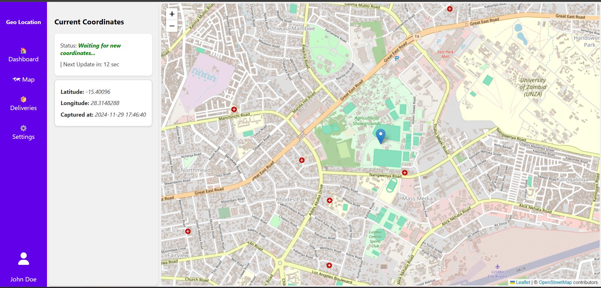
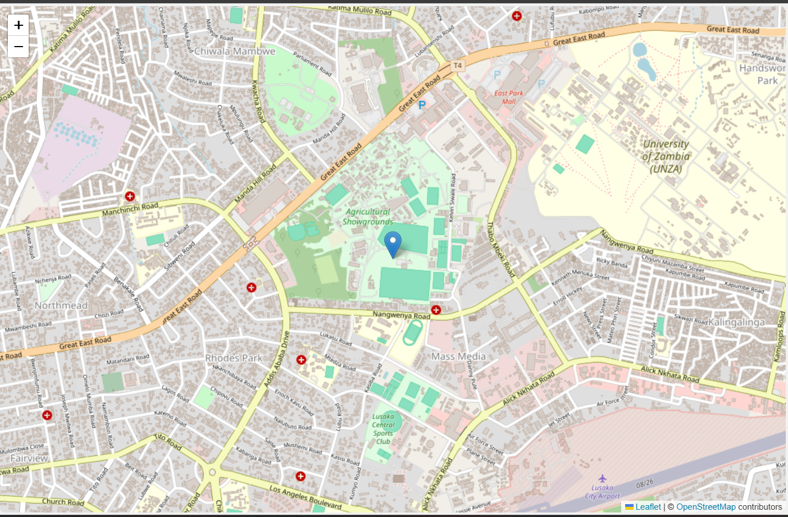

# Geo-Location Tracking

---
This project is a web application that tracks the user's geographical location and saves it to a MongoDB database. It consists of a frontend built with React and a backend powered by Node.js and Express, with geospatial visualization implemented using the Leaflet library.

## Technologies Used

---
- **Frontend:**
  - React
  - HTML
  - CSS
  - JavaScript
  - Leaflet

- **Backend:**
  - Node.js
  - Express
  - MongoDB

## Getting Started

---
To get a copy of the project up and running on your local machine for development and testing purposes, follow these instructions.

### Prerequisites
Make sure you have the following installed on your machine:

- [Node.js](https://nodejs.org/)
- [MongoDB](https://www.mongodb.com/)

### Clone the Repository

Clone this repository to your local machine:

```bash
git clone https://github.com/ChandaMC/Geo-Location.git
```

## Installation

---
### Backend

1. Navigate to the backend directory:

   ```bash
   cd geo-location/back-end
   ```

2. Install the required Node.js packages:

   ```bash
   npm install
   ```

3. Set up your MongoDB database:

  - Ensure your MongoDB server is running.
  - Create a database named `geo_location`.

4. Create a `.env` file in the `back-end` directory and add the following:

   ```bash
   MONGO_URI=mongodb://localhost:27017/geo_location
   PORT=5000
   ```

### Frontend

1. Navigate to the frontend directory:

   ```bash
   cd geo-location/front-end
   ```

2. Install the required React packages:

   ```bash
   npm install
   ```

## Running the Project

---
### Start the Backend Server

1. Navigate to the backend directory:

   ```bash
   cd geo-location/back-end
   ```

2. Start the Node.js server:

   ```bash
   npm start
   ```

   The backend server will run on [http://localhost:5000](http://localhost:5000).

### Start the Frontend Application

1. Open a new terminal window or tab.

2. Navigate to the frontend directory:

   ```bash
   cd geo-location/front-end
   ```

3. Start the React application:

   ```bash
   npm start
   ```

   The frontend will be accessible at [http://localhost:3000](http://localhost:3000).

## Available Scripts

---
In the frontend project directory, you can run:

- `npm start`: Runs the app in development mode.
- `npm test`: Launches the test runner.
- `npm run build`: Builds the app for production.
- `npm run eject`: Ejects the project for full configuration control.

## How It Works

---
1. The React app uses the browser's Geolocation API to fetch the user's current geolocation every 20 seconds.
2. The location data is displayed on an interactive map powered by Leaflet.
3. The backend saves the geolocation data to MongoDB and serves the data via RESTful API endpoints.

## API Endpoints

---
### **GET /api/coordinates**

- **Description:** Fetches the most recent geolocation data.
- **Response:**
  - Success:
    ```json
    [
      {
        "_id": "674ac9eb6592768338c3f1c0",
        "latitude": -15.4042368,
        "longitude": 28.3148288,
        "timestamp": "2024-11-29T15:46:40.230Z"
      }
    ]
    ```
  - Error:
    ```json
    {
      "message": "Failed to fetch coordinates",
      "error": "Error details"
    }
    ```

### **POST /api/coordinates**

- **Description:** Saves geolocation data to the database.
- **Request Body:**
  ```json
  {
    "latitude": -15.4042368,
    "longitude": 28.3148288
  }
  ```
- **Response:**
  - Success:
    ```json
    {
      "message": "Position saved successfully!"
    }
    ```
  - Error:
    ```json
    {
      "message": "Failed to save position",
      "error": "Error details"
    }
    ```

###

## Screenshots

---
Here are some screenshots of the project in action:

### Home Page


### Map Overlay


### Coordinate History


### Side Bar


### Database View


## Project Folder Structure:

---
```
Geo-location/
│
├── documentation/
│   ├── project_structure.txt
│   └─ project_screenshots/
│       ├── coordinates_history.png
│       ├── database.png
│       ├── homepage.png
│       ├── map.png
│       └── sidebar.png
│
├── back-end/                               # Backend directory for Node.js and Express server
│   ├── node_modules/                       # Node.js dependencies
│   ├── config/                             # Configuration files (e.g., database connection)
│   │   └── db.js                           # Database connection setup
│   ├── controllers/                        # Controller files for handling requests
│   │   └── locationController.js           # Handles requests related to location data
│   ├── my_models/                          # Models for interacting with the database
│   │   └── Position.js                     # Model representing the positions table in MySQL
│   ├── routes/                             # API route definitions
│   │   └── locationRoutes.js               # Routes for handling location-related API endpoints
│   ├── server.js                           # Main server file (entry point)
│   ├── package.json                        # Backend npm dependencies and scripts
│   └── package-lock.json                   # Exact dependency versions for npm
│
└── front-end/                               # Frontend directory for React app
│    ├── node_modules/                       # React dependencies
│    ├── public/                             # Public directory for static assets
│    │   ├── index.html                      # Main HTML file for React app
│    │   └── favicon.ico                     # Icon for the app
│    ├── src/                                # Source files for the React app
│    │   ├── components/                     # Reusable components
│    │   │   ├── PositionForm.jsx            # Form for user interaction with location data
│    │   │   └── PositionForm.css            # Styling for the PositionForm component
│    │   │   ├── MapView.jsx                 # Map display showing user location
│    │   │   └── MapView.css                 # Styling for the MapView component
│    │   │   ├── SideBar.jsx                 # Sidebar navigation and controls
│    │   │   └── SideBar.css                 # Styling for the SideBar component
│    │   │   ├── CoordinateHistory.jsx       # History list of past coordinates
│    │   │   └── CoordinateHistory.css       # Styling for the CoordinateHistory component
│    │   ├── App.css                         # Styling for the main App component
│    │   ├── App.jsx                         # Main App component
│    │   ├── index.js                        # Entry point for React app
│    │   └── services/                       # API service files for handling requests
│    │       ├── locationRoutes.js           # Frontend API routes configuration
│    │       ├── locationController.js       # Handles logic for interacting with location APIs
│    │       └── locationService.js          # Service layer for API calls
│    └──package.json                         # Frontend npm dependencies and scripts
│
└──  README.md                               # project README

```

## Known Issues / Potential Challenges

---
If you find any issues or have feedback, please [open an issue](https://github.com/ChandaMC/Geo-Location/issues) on GitHub.
Here’s a list of possible issues you can include in your README under a **"Known Issues"** or **"Potential Challenges"** section:

While using or setting up this project, you may encounter the following issues:

### 1. **Browser Permissions for Geolocation**
- Description: The application relies on the browser's Geolocation API. If location permissions are not granted, the app cannot fetch the user's current position.
- Resolution: Ensure location permissions are enabled in your browser settings for the application URL.

### 2. **Database Connection Errors**
- Description: Errors may occur if MongoDB is not running or the `MONGO_URI` in the `.env` file is incorrect.
- Resolution: Verify that your MongoDB server is running and the connection string in the `.env` file matches your database setup.

### 3. **CORS Policy Issues**
- Description: If the frontend and backend are hosted on different domains or ports, Cross-Origin Resource Sharing (CORS) errors may arise.
- Resolution: Ensure the backend includes CORS middleware. Example:

```bash
  const cors = require('cors');
  app.use(cors());
  ```

### 4. **Delayed Location Updates**
- Description: Geolocation updates every 20 seconds. If the browser or system delays processing, updates may not be accurate.
- Resolution: Ensure stable internet and adequate system resources while running the app.

### 5. **Map Rendering Issues**
- Description: The map component may fail to load if external Leaflet resources are not properly linked or if the network connection is unstable.
- Resolution: Verify your network connection and ensure Leaflet dependencies are installed and accessible.

### 6. **Frontend and Backend Sync**
- Description: If the frontend and backend servers are not running simultaneously or on mismatched configurations, the app will fail to fetch or send data.
- Resolution:
    - Ensure both servers are running on their respective ports (`5000` for backend, `3000` for frontend).
    - Verify the frontend `services/locationService.js` points to the correct backend URL.

### 7. **High API Call Frequency**
- Description: Constantly fetching user location every 20 seconds may put strain on the browser or system.
- Resolution: Consider reducing the update frequency if needed.

### 8. **Deployment Challenges**
- Description: When deploying to production, configuration for the database and environment variables may require changes.
- Resolution:
    - Use environment-specific variables.
    - Update the database connection URI and ensure all dependencies are installed on the production server.

---

## Contributing

---
Contributions are welcome! Feel free to submit a pull request or create an issue for any suggestions or improvements.


## License

---
This project is licensed under the MIT License—see the LICENSE file for details.


### Key Changes:
1. **Updated Database**: Changed references from MySQL to MongoDB and included `.env` setup for `MONGO_URI`.
2. **API Updates**: Reflected the `GET` and `POST` endpoints for MongoDB.
3. **Technologies**: Added Leaflet as a frontend technology.
4. **URLs**: Updated frontend and backend URLs where necessary.
5. **Styling and Clarity**: Ensured consistency in code formatting and instructions.

Let me know if there's anything else you'd like adjusted!